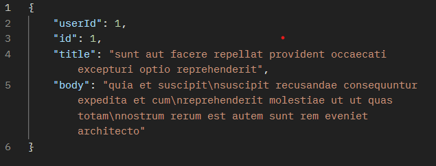
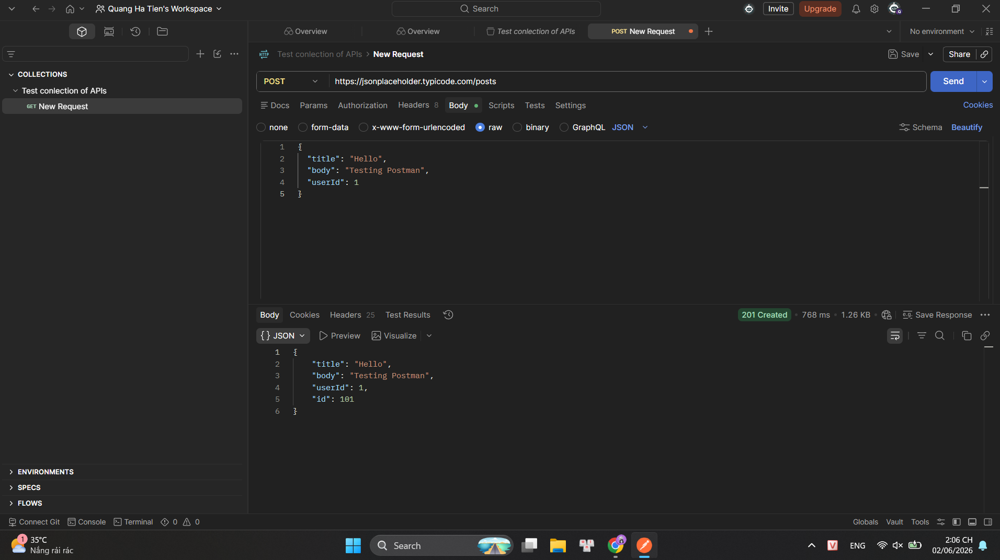
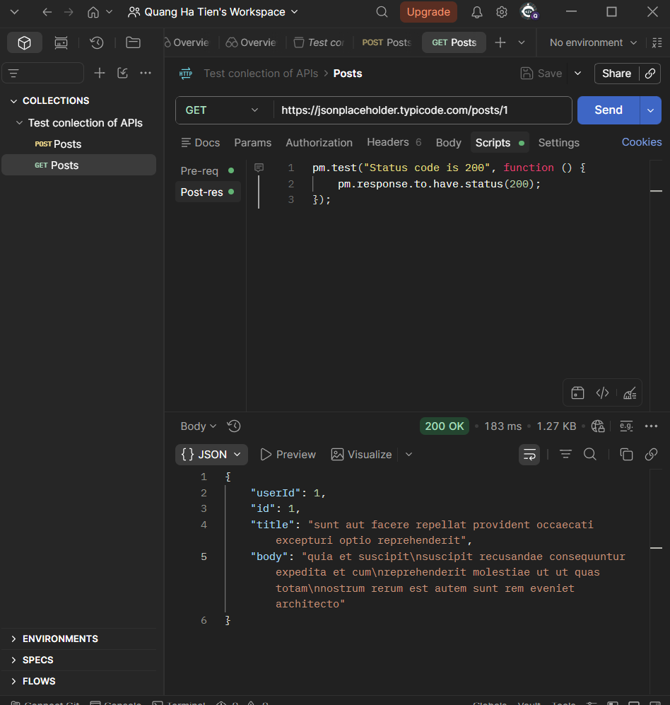
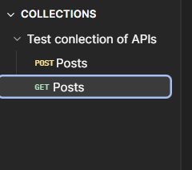

# BÁO CÁO THỰC HÀNH POSTMAN

## 1. Thông tin sinh viên

* Họ và tên: Hà Tiến Quang
* MSV: 22010136
* Môn học: Đánh giá và kiểm thử chất lượng phần mềm

## 2. Mục tiêu

Tìm hiểu và sử dụng công cụ Postman để kiểm thử API.

## 3. Nội dung thực hiện

### 3.1 Tạo Request GET

API sử dụng:

```http
GET https://jsonplaceholder.typicode.com/posts/1
```

Kết quả nhận được dữ liệu JSON từ server.



---

### 3.2 Tạo Request POST

API sử dụng:

```http
POST https://jsonplaceholder.typicode.com/posts
```

Dữ liệu gửi:

```json
{
  "title": "Hello",
  "body": "Testing Postman",
  "userId": 1
}
```

Kết quả trả về:

```json
{
  "title": "Hello",
  "body": "Testing Postman",
  "userId": 1,
  "id": 101
}
```



---

### 3.3 Viết Test Script

Kiểm tra mã trạng thái trả về:

```javascript
pm.test("Status code is 200", function () {
    pm.response.to.have.status(200);
});
```

Đối với request POST:

```javascript
pm.test("Status code is 201", function () {
    pm.response.to.have.status(201);
});
```



---

### 3.4 Tạo Collection

Các request được lưu trong Collection:

* GET Posts
* POST Posts



## 4. Kết quả đạt được

* Hiểu cách sử dụng Postman.
* Thực hiện được GET Request.
* Thực hiện được POST Request.
* Biết tạo Collection.
* Biết viết Test Script kiểm tra kết quả trả về.

## 5. Kết luận

Qua bài thực hành, em đã làm quen với công cụ Postman và thực hiện thành công việc kiểm thử API bằng các phương thức GET và POST, đồng thời biết cách tạo Collection và viết Test Script để kiểm tra phản hồi của API.
